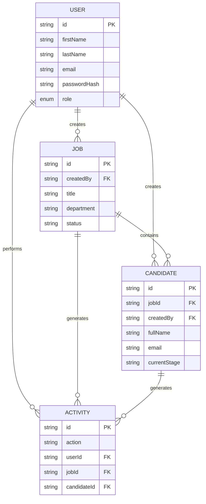

Great. I'll keep it at the level of a real startup engineering design document rather than a tutorial.
________________________________________
architecture.md
HireTrack Architecture
Architecture
HireTrack is a modern full-stack Applicant Tracking System (ATS) built using Next.js 15 App Router with a server-first architecture. The application combines Server Components for fast initial rendering with Client Components for interactive experiences. Authentication is handled using NextAuth/Auth.js, data persistence through Prisma ORM connected to a Neon PostgreSQL database, and form validation using React Hook Form with shared Zod schemas. Client-side server state is managed through TanStack Query, while charts are rendered using Recharts. The architecture follows a layered design that separates presentation, business logic, data access, and persistence, making the application maintainable, scalable, and suitable for production deployment on Vercel.
________________________________________
High-Level Architecture
Browser
      │
      ▼
Next.js 15 (App Router)
      │
      ▼
API Routes / Server Actions
      │
      ▼
Business Layer
      │
      ▼
Repository Layer
      │
      ▼
Prisma ORM
      │
      ▼
Neon PostgreSQL
________________________________________
Layer Responsibilities
Browser
Responsibilities:
•	Rendering UI
•	User interactions
•	Form submission
•	Navigation
•	Session cookie storage
The browser never communicates directly with the database.
________________________________________
Next.js Frontend
Responsibilities:
•	Rendering pages
•	Layout composition
•	Server Components
•	Client Components
•	Authentication-aware rendering
•	Data fetching
•	Route protection
The frontend remains thin and delegates business decisions to the backend layers.
________________________________________
API Routes / Server Actions
Responsibilities:
•	Receive requests
•	Validate authentication
•	Validate input
•	Call services
•	Return structured responses
These layers should not contain business rules.
________________________________________
Business Layer
Responsibilities:
•	Hiring workflow logic
•	Authorization checks
•	Candidate movement
•	Dashboard aggregation
•	Analytics computation
Business rules live here to ensure reuse across routes.
________________________________________
Repository Layer
Responsibilities:
•	Database queries
•	CRUD operations
•	Transaction handling
•	Query optimization
Repositories isolate Prisma from business logic.
________________________________________
Prisma ORM
Responsibilities:
•	Type-safe database access
•	Schema mapping
•	Query generation
•	Migrations
Prisma acts as the abstraction over PostgreSQL.
________________________________________
PostgreSQL (Neon)
Responsibilities:
•	Persistent storage
•	Indexes
•	Constraints
•	Relationships
•	Transactions
Neon provides managed PostgreSQL with serverless scaling.
________________________________________
System Diagram
flowchart TD

A[Browser]

A --> B[Next.js App Router]

B --> C[Server Components]

B --> D[Client Components]

D --> E[API Routes / Server Actions]

C --> E

E --> F[Auth.js]

F --> G[Session Cookie]

E --> H[Business Services]

H --> I[Repositories]

I --> J[Prisma ORM]

J --> K[(Neon PostgreSQL)]

K --> J

J --> I

I --> H

H --> E

E --> B
________________________________________
Authentication Flow
flowchart LR

User

--> Login

Login

--> Auth.js

Auth.js

--> VerifyCredentials

VerifyCredentials

--> Prisma

Prisma

--> PostgreSQL

PostgreSQL

--> Prisma

Prisma

--> Auth.js

Auth.js

--> SessionCookie

SessionCookie

--> ProtectedRoutes
________________________________________
Folder Structure
src/

├── app/
│   ├── (public)/
│   ├── (dashboard)/
│   ├── api/
│   ├── login/
│   ├── dashboard/
│   ├── jobs/
│   ├── candidates/
│   ├── analytics/
│   ├── settings/
│   ├── not-found.tsx
│   ├── error.tsx
│   └── loading.tsx
│
├── components/
│   ├── ui/
│   ├── layout/
│   ├── dashboard/
│   ├── jobs/
│   ├── candidates/
│   ├── analytics/
│   ├── pipeline/
│   └── shared/
│
├── actions/
│
├── services/
│
├── repositories/
│
├── hooks/
│
├── lib/
│
├── validators/
│
├── types/
│
├── providers/
│
├── prisma/
│
├── styles/
│
├── public/
│
└── docs/
________________________________________
Folder Explanations
app/
Contains all App Router pages, layouts, loading UI, error pages, API routes, and route groups.
________________________________________
components/
Reusable React components.
Separated by feature to avoid one massive component directory.
________________________________________
components/ui/
Reusable shadcn/ui components.
Examples:
•	Button
•	Card
•	Dialog
•	Input
•	Badge
•	Dropdown
•	Table
________________________________________
components/dashboard/
Dashboard widgets.
Examples:
•	Statistics Cards
•	Activity Feed
•	Charts
________________________________________
components/jobs/
Job-related UI.
Examples:
•	Job Form
•	Job Table
•	Job Card
________________________________________
components/candidates/
Candidate UI.
Examples:
•	Candidate Card
•	Candidate Table
•	Candidate Form
•	Candidate Profile
________________________________________
components/pipeline/
Pipeline board.
Includes:
•	Stage columns
•	Candidate cards
•	Drag-and-drop abstractions (if implemented later)
________________________________________
components/analytics/
Charts and KPI widgets.
________________________________________
components/shared/
Application-wide reusable components.
Examples:
•	Search Bar
•	Empty State
•	Loading Skeleton
•	Page Header
•	Confirm Dialog
________________________________________
actions/
Server Actions responsible for handling mutations while delegating business logic to services.
________________________________________
services/
Contains all business logic.
Examples:
•	JobService
•	CandidateService
•	DashboardService
•	AnalyticsService
Services coordinate validation, authorization, and repository calls.
________________________________________
repositories/
Encapsulates Prisma database access.
Examples:
•	JobRepository
•	CandidateRepository
•	UserRepository
•	ActivityRepository
________________________________________
hooks/
Custom React hooks.
Examples:
•	useCurrentUser
•	useDebounce
•	usePermissions
•	useSearch
________________________________________
lib/
Shared utilities.
Examples:
•	Prisma client
•	Auth configuration
•	Query helpers
•	Constants
•	Date utilities
________________________________________
validators/
Shared Zod schemas.
Used by:
•	Forms
•	API Routes
•	Server Actions
________________________________________
types/
Application-wide TypeScript types.
Examples:
•	Role
•	CandidateStatus
•	DashboardMetrics
________________________________________
providers/
React providers.
Examples:
•	TanStack Query Provider
•	Theme Provider
•	Session Provider
________________________________________
prisma/
Prisma schema and migrations.
________________________________________
public/
Static assets.
________________________________________
docs/
Project documentation.
Including:
•	PRD
•	Architecture
•	API documentation
________________________________________
Routing
Public Routes
/

/login
Only the login page is publicly accessible in the MVP. The root route may redirect authenticated users to the dashboard and unauthenticated users to the login page.
________________________________________
Authenticated Routes
/dashboard

/jobs

/jobs/new

/candidates

/candidates/new

/pipeline

/analytics

/settings
All authenticated routes require a valid session.
________________________________________
Dynamic Routes
/jobs/[jobId]

/jobs/[jobId]/edit

/candidates/[candidateId]

/candidates/[candidateId]/edit
Dynamic routes fetch data on the server and return a 404 response if the requested resource does not exist or the user lacks permission to access it.
________________________________________
Error Routes
error.tsx
Displays a user-friendly error screen for unexpected runtime exceptions within a route segment. Users should be able to retry the failed action without refreshing the entire application.
________________________________________
Not Found
not-found.tsx
Rendered when a route or resource cannot be found. It should provide navigation back to the dashboard or the previous page.
________________________________________
Loading Routes
loading.tsx
Each major route (Dashboard, Jobs, Candidates, Analytics, Pipeline, and Settings) should implement a loading state using skeleton components to provide immediate visual feedback while data is being fetched.
________________________________________
# Authentication Flow

Authentication is implemented using **NextAuth/Auth.js** with the **Credentials Provider**. User sessions are managed through secure HTTP-only cookies, and all authenticated routes are protected using middleware and server-side session validation. Passwords are never stored in plaintext and are verified using hashed values.

---

## Authentication Components

| Component | Responsibility |
|-----------|----------------|
| Login Page | Collect user credentials |
| Auth.js | Authentication provider and session management |
| Middleware | Protect authenticated routes |
| Prisma Adapter | Read user records from the database |
| Session Cookie | Persist authenticated session |
| Role Guard | Enforce role-based permissions |

---

## Login Flow

```text
User
    │
    ▼
Login Form
    │
    ▼
React Hook Form Validation
    │
    ▼
Zod Validation
    │
    ▼
Auth.js Credentials Provider
    │
    ▼
Find User
    │
    ▼
Verify Password Hash
    │
    ▼
Create Session
    │
    ▼
Store Secure Cookie
    │
    ▼
Redirect to Dashboard
```

### Steps

1. User submits email and password.
2. Client-side validation runs using React Hook Form and Zod.
3. Credentials are sent securely to Auth.js.
4. Auth.js queries the database through Prisma.
5. Password hash is verified.
6. Session is created.
7. Session cookie is returned.
8. User is redirected to the dashboard.

---

## Signup

The MVP does **not** include public registration.

Instead:

- Users are created by an Admin.
- Initial passwords are securely generated or assigned.
- Admin communicates credentials externally.

This simplifies authentication while maintaining controlled access.

---

## Session Creation

After successful authentication:

- Session is generated.
- User ID is stored.
- User role is stored.
- Session expiration timestamp is stored.

The session becomes the source of truth for authorization throughout the application.

---

## Protected Routes

The following routes require authentication:

- Dashboard
- Jobs
- Candidates
- Pipeline
- Analytics
- Settings

Unauthenticated users attempting to access these routes are redirected to `/login`.

---

## Middleware

Middleware executes before protected pages are rendered.

Responsibilities:

- Check session existence.
- Redirect unauthenticated users.
- Prevent authenticated users from revisiting the login page.
- Attach authentication context.

Middleware does **not** perform business logic.

---

## Role Checks

Every protected action validates user roles before execution.

Example:

```
Recruiter
    │
    ▼
Create Candidate
    │
    ▼
Role Validation
    │
    ▼
Allowed
```

```
Viewer
    │
    ▼
Delete Job
    │
    ▼
Role Validation
    │
    ▼
403 Forbidden
```

Role validation occurs:

- Before mutations
- Before protected page rendering
- Before sensitive API requests

---

## Session Refresh

Sessions should automatically refresh while active.

Benefits:

- Reduced login frequency
- Better user experience
- Improved security through expiration management

Expired sessions require re-authentication.

---

## Logout Flow

```text
Logout Button
      │
      ▼
Destroy Session
      │
      ▼
Clear Cookie
      │
      ▼
Redirect to Login
```

---

## Password Hashing

Passwords are never stored directly.

Workflow:

```
Password
      │
      ▼
Hash Function
      │
      ▼
Database
```

During login:

```
Entered Password
        │
        ▼
Hash Verification
        │
        ▼
Authenticated / Rejected
```

Only hashed passwords are persisted.

---

## Cookie Strategy

Session cookies should be:

- HTTP-only
- Secure in production
- SameSite protected
- Automatically expired
- Signed

Sensitive authentication data should never be accessible from client-side JavaScript.

---

# Authorization Model

HireTrack uses **Role-Based Access Control (RBAC)**.

Authorization determines **what** an authenticated user is allowed to do.

Three roles are supported.

- Admin
- Recruiter
- Viewer

---

## Admin

Purpose:

System administrator.

Capabilities:

- Manage users
- Create jobs
- Edit jobs
- Delete jobs
- Create candidates
- Edit candidates
- Delete candidates
- Move pipeline stages
- View analytics
- Manage settings
- Archive jobs

---

## Recruiter

Purpose:

Primary operational user.

Capabilities:

- View dashboard
- Create jobs
- Edit jobs
- Archive jobs
- Create candidates
- Edit candidates
- Move pipeline
- View analytics
- Manage own profile

Cannot:

- Delete users
- Manage users
- Delete jobs
- Delete candidates

---

## Viewer

Purpose:

Read-only stakeholder.

Capabilities:

- View dashboard
- View jobs
- View candidates
- View analytics
- View pipeline

Cannot:

- Create
- Edit
- Delete
- Move pipeline
- Manage users

---

# Permissions Matrix

| Feature | Admin | Recruiter | Viewer |
|----------|:----:|:---------:|:------:|
| Login | ✓ | ✓ | ✓ |
| Dashboard | ✓ | ✓ | ✓ |
| View Jobs | ✓ | ✓ | ✓ |
| Create Job | ✓ | ✓ | ✗ |
| Edit Job | ✓ | ✓ | ✗ |
| Archive Job | ✓ | ✓ | ✗ |
| Delete Job | ✓ | ✗ | ✗ |
| View Candidates | ✓ | ✓ | ✓ |
| Add Candidate | ✓ | ✓ | ✗ |
| Edit Candidate | ✓ | ✓ | ✗ |
| Delete Candidate | ✓ | ✗ | ✗ |
| Move Pipeline | ✓ | ✓ | ✗ |
| View Analytics | ✓ | ✓ | ✓ |
| Manage Users | ✓ | ✗ | ✗ |
| Update Own Profile | ✓ | ✓ | ✓ |

---

## Authorization Enforcement

Authorization is validated in three places.

### 1. UI

Buttons and actions unavailable to unauthorized users are hidden or disabled.

Example:

Viewer users never see:

- Delete buttons
- Edit buttons
- Create buttons

---

### 2. Server

Every mutation validates permissions.

Client-side restrictions alone are never trusted.

---

### 3. Database Operations

Repositories never execute privileged operations unless authorization has already been validated.

---

# Database Design

The database is normalized around five primary entities.

```
User

↓

Job

↓

Candidate

↓

Activity
```

Candidate records belong to Jobs.

Activities capture an audit trail.

---

## User

### Purpose

Represents authenticated application users.

### Fields

- id
- firstName
- lastName
- email
- passwordHash
- role
- avatarUrl
- createdAt
- updatedAt

### Relationships

One User

- creates many Jobs
- creates many Candidates
- performs many Activities

### Primary Key

- id

### Foreign Keys

None

### Indexes

- email (unique)
- role

### Constraints

- Email unique
- Role required
- Password required

### Soft Delete

Not used in MVP.

Administrative deletion is permanent.

### Timestamps

- createdAt
- updatedAt

---

## Job

### Purpose

Represents an open hiring position.

### Fields

- id
- title
- department
- location
- employmentType
- description
- status
- createdBy
- createdAt
- updatedAt

### Relationships

One Job

- has many Candidates
- belongs to one User

### Primary Key

- id

### Foreign Keys

- createdBy → User

### Indexes

- status
- department
- createdAt

### Constraints

- Title required
- Status required

### Soft Delete

Jobs are archived rather than deleted by Recruiters.

Only Admins may permanently delete jobs.

### Timestamps

- createdAt
- updatedAt

---

## Candidate

### Purpose

Represents a job applicant.

### Fields

- id
- fullName
- email
- phone
- resumeUrl
- currentStage
- notes
- jobId
- createdBy
- createdAt
- updatedAt

### Relationships

Belongs to one Job.

Created by one User.

Has many Activities.

### Primary Key

- id

### Foreign Keys

- jobId
- createdBy

### Indexes

- email
- currentStage
- jobId

### Constraints

- Name required
- Email required
- Job required

### Soft Delete

Permanent deletion by Admin only.

### Timestamps

- createdAt
- updatedAt

---

## Activity

### Purpose

Stores an immutable audit trail.

Examples:

- Job created
- Candidate added
- Candidate moved
- Job archived

### Fields

- id
- action
- userId
- jobId
- candidateId
- createdAt

### Relationships

Belongs to:

- User
- Job
- Candidate

### Primary Key

- id

### Foreign Keys

- userId
- jobId
- candidateId

### Indexes

- createdAt
- userId
- candidateId

### Constraints

- Action required

### Soft Delete

Never.

Activities are immutable.

### Timestamp

- createdAt

---

# Entity Relationship Diagram


# API Architecture

HireTrack exposes a RESTful API through **Next.js Route Handlers** (`app/api`). Route handlers are responsible only for request parsing, authentication, validation, and response formatting. All business logic resides in the service layer.

## API Design Principles

- Resource-oriented REST endpoints
- JSON request and response bodies
- Stateless requests
- Consistent HTTP status codes
- Standardized error response format
- Role-based authorization on protected endpoints
- Input validation using shared Zod schemas

---

# Authentication Module

## POST /api/auth/login

### Purpose

Authenticate a user and create a session.

### Authentication

No

### Validation

- Valid email
- Password required

### Response

```json
{
  "user": {},
  "session": {}
}
```

### Possible Errors

- 400 Invalid input
- 401 Invalid credentials
- 500 Internal server error

---

## POST /api/auth/logout

### Purpose

Destroy the active session.

### Authentication

Required

### Response

204 No Content

### Possible Errors

- 401 Unauthorized

---

## GET /api/auth/me

### Purpose

Return the currently authenticated user.

### Authentication

Required

### Response

```json
{
  "id": "...",
  "name": "...",
  "email": "...",
  "role": "Recruiter"
}
```

### Possible Errors

- 401 Unauthorized

---

# Jobs Module

## GET /api/jobs

### Purpose

Retrieve paginated jobs.

Authentication: Required

Validation:

- page
- pageSize
- search
- status

Response:

```json
{
  "items": [],
  "pagination": {}
}
```

Errors:

- 401
- 500

---

## GET /api/jobs/:id

Retrieve a single job.

Authentication:

Required

Errors:

- 401
- 403
- 404

---

## POST /api/jobs

Purpose:

Create job.

Authentication:

Recruiter/Admin

Validation:

Shared Job schema.

Response:

Created Job.

Errors:

- 400
- 401
- 403
- 409

---

## PATCH /api/jobs/:id

Purpose:

Update job.

Authentication:

Recruiter/Admin

Errors:

- 400
- 401
- 403
- 404

---

## DELETE /api/jobs/:id

Purpose:

Delete job.

Authentication:

Admin

Errors:

- 401
- 403
- 404

---

# Candidates Module

## GET /api/candidates

Returns paginated candidates.

Supports:

- search
- stage
- job
- page
- pageSize

---

## GET /api/candidates/:id

Returns candidate profile.

---

## POST /api/candidates

Creates candidate.

Requires:

Recruiter/Admin

---

## PATCH /api/candidates/:id

Updates candidate.

---

## DELETE /api/candidates/:id

Deletes candidate.

Admin only.

---

## PATCH /api/candidates/:id/stage

Purpose:

Move candidate through pipeline.

Validation:

Stage must be valid.

Response:

Updated candidate.

Errors:

- Invalid stage
- Candidate not found
- Unauthorized

---

# Dashboard Module

## GET /api/dashboard

Returns:

- Statistics
- Recent activity
- Recent jobs
- Recent candidates

Authentication:

Required

---

# Analytics Module

## GET /api/analytics

Returns:

- Jobs by status
- Candidates by stage
- Hiring metrics

Authentication:

Required

---

# Settings Module

## GET /api/settings/profile

Returns current profile.

---

## PATCH /api/settings/profile

Updates profile.

---

## GET /api/users

Admin only.

Returns all users.

---

## POST /api/users

Admin only.

Creates user.

---

## PATCH /api/users/:id

Admin only.

Updates user.

---

## DELETE /api/users/:id

Admin only.

Deletes user.

---

# API Response Format

## Success

```json
{
  "success": true,
  "data": {},
  "message": "Operation completed."
}
```

---

## Validation Error

```json
{
  "success": false,
  "error": {
    "code": "VALIDATION_ERROR",
    "message": "Invalid input.",
    "fields": {}
  }
}
```

---

## Authorization Error

```json
{
  "success": false,
  "error": {
    "code": "FORBIDDEN",
    "message": "Insufficient permissions."
  }
}
```

---

## Server Error

```json
{
  "success": false,
  "error": {
    "code": "INTERNAL_SERVER_ERROR",
    "message": "Unexpected server error."
  }
}
```

---

# Business Logic Layer

The business layer contains all application rules and coordinates interactions between route handlers and repositories.

```
API Route
      │
      ▼
Service
      │
      ▼
Repository
      │
      ▼
Prisma
```

Business logic is intentionally isolated to improve maintainability, reuse, and testability.

---

## Controllers (Route Handlers)

Responsibilities:

- Parse request
- Authenticate user
- Validate request
- Call service
- Return response

Controllers should remain thin and never contain business rules.

---

## Services

Services encapsulate all business workflows.

Examples:

### JobService

Responsible for:

- Creating jobs
- Updating jobs
- Archiving jobs
- Permission validation
- Activity creation

---

### CandidateService

Responsible for:

- Candidate CRUD
- Pipeline movement
- Notes management
- Duplicate detection

---

### DashboardService

Responsible for:

- Dashboard aggregation
- KPI calculation
- Recent activity retrieval

---

### AnalyticsService

Responsible for:

- Metrics
- Stage summaries
- Chart datasets

---

### UserService

Responsible for:

- User management
- Profile updates
- Role changes
- Password updates

---

## Repositories

Repositories isolate all database interactions.

Responsibilities:

- CRUD operations
- Pagination
- Search queries
- Transactions
- Query optimization

Repositories must never contain UI logic or business decisions.

---

## Validation Layer

Validation occurs before business logic executes.

Responsibilities:

- Input validation
- Data transformation
- Type inference
- Constraint enforcement

Shared Zod schemas ensure consistent validation between client and server.

---

## Utilities

Utilities provide reusable helper functionality.

Examples:

- Date formatting
- Pagination helpers
- Search parameter parsing
- Constants
- Role utilities
- Activity message generation

Utilities must remain stateless and free of business rules.

---

## Why Business Logic Should Not Live in Route Handlers

Keeping business logic inside route handlers leads to:

- Code duplication
- Difficult testing
- Tight coupling
- Poor maintainability

Separating concerns allows:

- Reusable services
- Easier unit testing
- Cleaner API routes
- Simpler future feature additions

---

# State Management

HireTrack separates **server state** from **client state**.

## Server State

Managed using **TanStack Query**.

Examples:

- Jobs
- Candidates
- Dashboard metrics
- Analytics
- User profile

Benefits:

- Automatic caching
- Background refetching
- Mutation support
- Request deduplication
- Cache invalidation

---

## Client State

Managed using React state.

Examples:

- Modal visibility
- Selected table rows
- Active filters
- Search input
- Form state
- Sidebar state

Global state libraries are unnecessary for this MVP.

---

## Caching Strategy

TanStack Query caches server responses.

Typical behavior:

```
Request

↓

Cache Miss

↓

API

↓

Store Cache

↓

UI
```

Subsequent requests use cached data until invalidated or stale.

---

## Mutations

Mutations include:

- Create Job
- Edit Job
- Archive Job
- Add Candidate
- Move Pipeline Stage
- Update Profile

After successful mutations:

- Relevant queries are invalidated
- Fresh data is automatically refetched

---

## Optimistic Updates

Optimistic updates are appropriate for lightweight actions where immediate feedback improves perceived performance.

Recommended:

- Pipeline stage changes
- Candidate status updates

Avoid optimistic updates for destructive actions such as deletion.

---

## Loading States

Each query exposes:

- isLoading
- isFetching
- isPending

The UI should display:

- Skeleton loaders
- Disabled buttons
- Spinner indicators

---

## Error Handling

Each query exposes error states.

The UI should:

- Display descriptive messages
- Offer retry actions
- Preserve existing data when appropriate

---

## Why TanStack Query

TanStack Query is selected because it provides:

- Excellent caching
- Automatic synchronization
- Background updates
- Retry logic
- Optimistic mutations
- Pagination support
- Minimal boilerplate

It eliminates the need for custom data-fetching logic and reduces complexity.

---

# Validation Strategy

Validation is centralized using **Zod** to ensure consistency across the application.

```
User Input
      │
      ▼
React Hook Form
      │
      ▼
Shared Zod Schema
      │
      ▼
API Route
      │
      ▼
Service
      │
      ▼
Database
```

---

## Form Validation

React Hook Form integrates directly with Zod.

Responsibilities:

- Required fields
- Email validation
- Password rules
- Field length
- Immediate user feedback

Validation errors are displayed inline.

---

## API Validation

Every incoming request is validated using the same Zod schemas before reaching the service layer.

Benefits:

- Prevent malformed requests
- Consistent error responses
- Strong typing

---

## Database Boundary Validation

Before persistence:

- Required fields confirmed
- Enum values validated
- Relationship identifiers verified
- Business constraints checked

This prevents invalid data from reaching the database.

---

## Environment Variable Validation

Application configuration should be validated during startup using a dedicated Zod schema.

Variables include:

- DATABASE_URL
- AUTH_SECRET
- NEXTAUTH_URL

Startup should fail immediately if required variables are missing or invalid.

---

## Benefits of Shared Validation

Using a single source of truth for validation provides:

- Consistent behavior
- Reduced duplication
- Strong TypeScript inference
- Easier maintenance
- Fewer runtime errors

Every layer of the application relies on the same validation contracts, ensuring predictable behavior from the UI through to the database.

# Error Handling

HireTrack uses a centralized error handling strategy to provide consistent user feedback while preventing sensitive implementation details from being exposed.

Errors are categorized into validation, authentication, authorization, resource, and server errors.

```
Request
    │
    ▼
Validation
    │
    ▼
Business Logic
    │
    ▼
Database
    │
    ▼
Response
```

---

## Validation Errors

Validation errors occur before business logic executes.

Examples:

- Required field missing
- Invalid email
- Invalid candidate stage
- Invalid query parameter

Behavior:

- Return HTTP 400
- Display inline form validation
- Prevent submission

Example response:

```json
{
  "success": false,
  "error": {
    "code": "VALIDATION_ERROR",
    "message": "Please correct the highlighted fields."
  }
}
```

---

## Authentication Errors

Occur when the user is not logged in or the session has expired.

Examples:

- Missing session
- Invalid credentials
- Expired cookie

Behavior:

- Return HTTP 401
- Redirect to login when appropriate

---

## Authorization Errors

Occur when the authenticated user lacks permission.

Examples:

- Viewer attempting to edit a job
- Recruiter deleting users

Behavior:

- Return HTTP 403
- Display permission error toast
- Do not expose implementation details

---

## Resource Not Found (404)

Returned when:

- Job does not exist
- Candidate does not exist
- Invalid dynamic route

Behavior:

- Render custom 404 page
- Offer navigation back to Dashboard

---

## Internal Server Errors (500)

Unexpected failures should:

- Return generic error messages
- Log detailed error information
- Avoid exposing stack traces

Users should see a friendly message with the option to retry.

---

## Unexpected Exceptions

Unexpected runtime exceptions are handled using:

- Route-level `error.tsx`
- Global error boundary
- Server logging

The application should fail gracefully without crashing the entire interface.

---

## Toast Notifications

Toast notifications provide immediate feedback for user actions.

### Success

- Job created
- Candidate updated
- Profile saved

### Warning

- Unsaved changes
- Duplicate email

### Error

- Failed API request
- Network issue
- Permission denied

### Info

- Job archived
- Pipeline stage updated

---

## Logging

Errors should be logged with:

- Timestamp
- User ID (if available)
- Route
- Request ID
- Error category
- Stack trace (server only)

Sensitive information must never be logged.

---

# Security

Security is enforced at multiple layers of the application.

---

## Authentication

Authentication is handled by Auth.js using secure session cookies.

Requirements:

- Secure cookies
- HTTP-only cookies
- Session expiration
- Protected routes

---

## Role-Based Access Control (RBAC)

Authorization is enforced:

- Before page rendering
- Before API execution
- Before database mutations

Permissions are never enforced solely in the UI.

---

## SQL Injection Prevention

Prisma ORM uses parameterized queries and generated SQL.

Benefits:

- Prevents SQL injection attacks
- Strong typing
- Safe query construction

---

## Cross-Site Scripting (XSS)

User-generated content should be treated as untrusted.

Mitigations:

- React automatic escaping
- Input validation
- Output sanitization where needed

---

## Cross-Site Request Forgery (CSRF)

Session-based authentication requires CSRF protection.

Measures include:

- SameSite cookies
- CSRF tokens (handled by Auth.js where applicable)

---

## Rate Limiting

Authentication endpoints should be rate limited.

Examples:

- Login attempts
- Password reset (future)

Purpose:

- Reduce brute-force attacks
- Prevent abuse

---

## Password Hashing

Passwords should:

- Never be stored in plaintext
- Be hashed using a secure algorithm
- Be verified securely during login

---

## Environment Variables

Sensitive configuration must never be committed.

Examples:

- DATABASE_URL
- AUTH_SECRET
- NEXTAUTH_URL

Validation occurs during startup.

---

## Secrets Management

Secrets should be managed using Vercel Environment Variables.

Separate values should exist for:

- Development
- Preview
- Production

---

## HTTP Headers

Recommended security headers:

- Content Security Policy
- X-Frame-Options
- X-Content-Type-Options
- Referrer Policy
- Strict-Transport-Security

---

# Performance

Performance is prioritized through server rendering, efficient database access, and caching.

---

## Pagination

Jobs and candidates should use server-side pagination.

Benefits:

- Faster queries
- Reduced payload size
- Better scalability

---

## Search

Search should execute on the server.

Advantages:

- Smaller client bundles
- Better scalability
- Indexed queries

---

## Database Indexing

Recommended indexes:

User

- Email
- Role

Job

- Status
- Department
- CreatedAt

Candidate

- Email
- JobId
- CurrentStage

Activity

- CreatedAt
- UserId

---

## Caching

TanStack Query provides:

- Query caching
- Background refetch
- Automatic invalidation

---

## Image Optimization

User avatars should use Next.js Image optimization.

Benefits:

- Lazy loading
- Responsive sizing
- Smaller payloads

---

## Lazy Loading

Heavy components should load only when needed.

Examples:

- Charts
- Analytics
- Large tables

---

## Server Components

Pages that primarily display data should be implemented as Server Components whenever possible.

Benefits:

- Reduced JavaScript
- Faster initial render
- Improved SEO
- Better performance

---

## Code Splitting

Next.js automatically splits code by route.

Large feature modules remain isolated, reducing initial bundle size.

---

# Accessibility

HireTrack should meet WCAG 2.1 AA guidelines where practical.

---

## Keyboard Navigation

All interactive elements must be reachable via keyboard.

---

## ARIA

Use semantic HTML first.

Supplement with ARIA only where necessary.

Examples:

- Dialogs
- Dropdowns
- Tabs
- Navigation

---

## Focus Management

Focus should:

- Move into dialogs
- Return after dialog closes
- Remain visible

---

## Contrast

Text and interactive elements should maintain sufficient contrast.

Avoid relying solely on color to communicate meaning.

---

## Screen Readers

All controls should include:

- Labels
- Descriptions
- Accessible names

---

## Forms

Forms should support:

- Label associations
- Error announcements
- Keyboard submission
- Required indicators

---

# Responsive Design

HireTrack is desktop-first while remaining fully functional on tablets and mobile devices.

---

## Mobile

Navigation:

- Collapsible drawer
- Single-column layouts
- Card-based tables

---

## Tablet

Layout:

- Two-column dashboard where appropriate
- Responsive forms
- Adaptive tables

---

## Desktop

Layout:

- Persistent sidebar
- Multi-column dashboard
- Full-width tables

---

## Breakpoints

Recommended Tailwind breakpoints:

- `sm`
- `md`
- `lg`
- `xl`
- `2xl`

---

## Navigation Behavior

Desktop:

Persistent sidebar.

Mobile:

Hamburger menu with slide-out navigation.

---

## Tables

Desktop:

Full data tables.

Mobile:

Horizontal scroll or stacked cards for readability.

---

## Cards

Cards should stack vertically on smaller screens and expand into responsive grids on larger displays.

---

# Dashboard Architecture

The dashboard provides a high-level overview of hiring activity.

Each widget retrieves data independently to allow isolated loading and error states.

---

## Statistics Cards

Display:

- Total Jobs
- Open Jobs
- Total Candidates
- Candidates by Stage (summary)

Purpose:

Provide an at-a-glance snapshot of hiring activity.

---

## Recent Activity

Displays the latest actions recorded in the Activity entity.

Examples:

- Job created
- Candidate added
- Pipeline stage changed

---

## Charts

Implemented with Recharts.

Suggested visualizations:

- Candidates by Stage (Bar Chart)
- Jobs by Status (Pie Chart)

Charts consume aggregated data returned by the Analytics API.

---

## Quick Actions

Provide shortcuts to common workflows:

- Create Job
- Add Candidate

Visibility depends on user permissions.

---

## Recent Candidates

Displays the most recently added candidates with basic information and quick navigation to their profiles.

---

## Recent Jobs

Displays recently created or updated jobs with status indicators.

---

# Search Architecture

Search is implemented server-side for scalability and consistency.

---

## Debounced Search

User input is debounced before sending requests to reduce unnecessary network traffic.

---

## Server-Side Search

The backend performs filtering and searching against indexed database fields.

Advantages:

- Faster large dataset handling
- Reduced client memory usage

---

## Filtering

Supported filters:

Jobs

- Status
- Department

Candidates

- Current Stage
- Job

---

## Sorting

Supported sorting:

- Name
- Created Date
- Updated Date
- Status

---

## Pagination

Search results remain paginated.

Changing pages preserves active filters and search terms.

---

## URL Query Parameters

Search state is reflected in the URL.

Examples:

```
/jobs?search=frontend&page=2

/candidates?stage=Interview&page=1
```

Benefits:

- Bookmarkable pages
- Shareable links
- Browser history support

---

# Logging & Monitoring

---

## Activity Logs

User actions generate Activity records.

Tracked events include:

- Job creation
- Job updates
- Candidate creation
- Candidate movement
- Job archival

These records support auditability and dashboard activity feeds.

---

## Error Logs

Server-side errors should be captured with:

- Timestamp
- Route
- User ID (if available)
- Error category
- Stack trace

Logs should exclude sensitive information.

---

## Analytics

Basic application analytics may include:

- Total jobs
- Total candidates
- Candidate stage distribution

No user tracking or behavioral analytics are included in the MVP.

---

## Future Monitoring

The architecture can integrate production monitoring tools (e.g., error tracking and performance monitoring) without significant refactoring due to the separation of concerns between presentation, business logic, and data access.

---

# Deployment

HireTrack is designed for deployment on **Vercel** with a managed **Neon PostgreSQL** database.

---

## Deployment Architecture

```
Developer
      │
      ▼
GitHub Repository
      │
      ▼
Vercel Build
      │
      ▼
Next.js Application
      │
      ▼
Neon PostgreSQL
```

---

## Environment Variables

Required variables include:

- `DATABASE_URL`
- `AUTH_SECRET`
- `NEXTAUTH_URL`

These values should be configured separately for development, preview, and production environments.

---

## Neon Database

Neon provides:

- Managed PostgreSQL
- Automatic backups (per Neon plan)
- Connection pooling support
- Serverless scaling

---

## Migration Strategy

Database schema changes should be managed through Prisma migrations.

Recommended workflow:

1. Update Prisma schema.
2. Generate migration.
3. Test locally.
4. Commit migration files.
5. Apply migrations during deployment.

Avoid manual schema changes in production.

---

## Production Checklist

- Environment variables configured
- Prisma migrations applied
- Production build succeeds
- Authentication verified
- RBAC verified
- Loading and error states tested
- Responsive layouts validated
- Accessibility checks completed
- Performance reviewed

---

# Future Scalability

The architecture is intentionally modular to support future enhancements without major refactoring.

Potential additions include:

- Notifications
- Email integration
- AI-assisted resume analysis
- File uploads
- Interview scheduling
- Teams
- Multi-organization support

Because responsibilities are separated into services, repositories, and route handlers, these features can be introduced by extending existing modules rather than rewriting the application's core structure.

---

# Trade-offs

This architecture favors simplicity, maintainability, and production readiness over unnecessary complexity.

## Chosen ApproGreat. I'll keep it at the level of a real startup engineering design document rather than a tutorial.
________________________________________
architecture.md
HireTrack Architecture
Architecture
HireTrack is a modern full-stack Applicant Tracking System (ATS) built using Next.js 15 App Router with a server-first architecture. The application combines Server Components for fast initial rendering with Client Components for interactive experiences. Authentication is handled using NextAuth/Auth.js, data persistence through Prisma ORM connected to a Neon PostgreSQL database, and form validation using React Hook Form with shared Zod schemas. Client-side server state is managed through TanStack Query, while charts are rendered using Recharts. The architecture follows a layered design that separates presentation, business logic, data access, and persistence, making the application maintainable, scalable, and suitable for production deployment on Vercel.
________________________________________
High-Level Architecture
Browser
      │
      ▼
Next.js 15 (App Router)
      │
      ▼
API Routes / Server Actions
      │
      ▼
Business Layer
      │
      ▼
Repository Layer
      │
      ▼
Prisma ORM
      │
      ▼
Neon PostgreSQL
________________________________________
Layer Responsibilities
Browser
Responsibilities:
•	Rendering UI
•	User interactions
•	Form submission
•	Navigation
•	Session cookie storage
The browser never communicates directly with the database.
________________________________________
Next.js Frontend
Responsibilities:
•	Rendering pages
•	Layout composition
•	Server Components
•	Client Components
•	Authentication-aware rendering
•	Data fetching
•	Route protection
The frontend remains thin and delegates business decisions to the backend layers.
________________________________________
API Routes / Server Actions
Responsibilities:
•	Receive requests
•	Validate authentication
•	Validate input
•	Call services
•	Return structured responses
These layers should not contain business rules.
________________________________________
Business Layer
Responsibilities:
•	Hiring workflow logic
•	Authorization checks
•	Candidate movement
•	Dashboard aggregation
•	Analytics computation
Business rules live here to ensure reuse across routes.
________________________________________
Repository Layer
Responsibilities:
•	Database queries
•	CRUD operations
•	Transaction handling
•	Query optimization
Repositories isolate Prisma from business logic.
________________________________________
Prisma ORM
Responsibilities:
•	Type-safe database access
•	Schema mapping
•	Query generation
•	Migrations
Prisma acts as the abstraction over PostgreSQL.
________________________________________
PostgreSQL (Neon)
Responsibilities:
•	Persistent storage
•	Indexes
•	Constraints
•	Relationships
•	Transactions
Neon provides managed PostgreSQL with serverless scaling.
________________________________________
System Diagram
flowchart TD

A[Browser]

A --> B[Next.js App Router]

B --> C[Server Components]

B --> D[Client Components]

D --> E[API Routes / Server Actions]

C --> E

E --> F[Auth.js]

F --> G[Session Cookie]

E --> H[Business Services]

H --> I[Repositories]

I --> J[Prisma ORM]

J --> K[(Neon PostgreSQL)]

K --> J

J --> I

I --> H

H --> E

E --> B
________________________________________
Authentication Flow
flowchart LR

User

--> Login

Login

--> Auth.js

Auth.js

--> VerifyCredentials

VerifyCredentials

--> Prisma

Prisma

--> PostgreSQL

PostgreSQL

--> Prisma

Prisma

--> Auth.js

Auth.js

--> SessionCookie

SessionCookie

--> ProtectedRoutes
________________________________________
Folder Structure
src/

├── app/
│   ├── (public)/
│   ├── (dashboard)/
│   ├── api/
│   ├── login/
│   ├── dashboard/
│   ├── jobs/
│   ├── candidates/
│   ├── analytics/
│   ├── settings/
│   ├── not-found.tsx
│   ├── error.tsx
│   └── loading.tsx
│
├── components/
│   ├── ui/
│   ├── layout/
│   ├── dashboard/
│   ├── jobs/
│   ├── candidates/
│   ├── analytics/
│   ├── pipeline/
│   └── shared/
│
├── actions/
│
├── services/
│
├── repositories/
│
├── hooks/
│
├── lib/
│
├── validators/
│
├── types/
│
├── providers/
│
├── prisma/
│
├── styles/
│
├── public/
│
└── docs/
________________________________________
Folder Explanations
app/
Contains all App Router pages, layouts, loading UI, error pages, API routes, and route groups.
________________________________________
components/
Reusable React components.
Separated by feature to avoid one massive component directory.
________________________________________
components/ui/
Reusable shadcn/ui components.
Examples:
•	Button
•	Card
•	Dialog
•	Input
•	Badge
•	Dropdown
•	Table
________________________________________
components/dashboard/
Dashboard widgets.
Examples:
•	Statistics Cards
•	Activity Feed
•	Charts
________________________________________
components/jobs/
Job-related UI.
Examples:
•	Job Form
•	Job Table
•	Job Card
________________________________________
components/candidates/
Candidate UI.
Examples:
•	Candidate Card
•	Candidate Table
•	Candidate Form
•	Candidate Profile
________________________________________
components/pipeline/
Pipeline board.
Includes:
•	Stage columns
•	Candidate cards
•	Drag-and-drop abstractions (if implemented later)
________________________________________
components/analytics/
Charts and KPI widgets.
________________________________________
components/shared/
Application-wide reusable components.
Examples:
•	Search Bar
•	Empty State
•	Loading Skeleton
•	Page Header
•	Confirm Dialog
________________________________________
actions/
Server Actions responsible for handling mutations while delegating business logic to services.
________________________________________
services/
Contains all business logic.
Examples:
•	JobService
•	CandidateService
•	DashboardService
•	AnalyticsService
Services coordinate validation, authorization, and repository calls.
________________________________________
repositories/
Encapsulates Prisma database access.
Examples:
•	JobRepository
•	CandidateRepository
•	UserRepository
•	ActivityRepository
________________________________________
hooks/
Custom React hooks.
Examples:
•	useCurrentUser
•	useDebounce
•	usePermissions
•	useSearch
________________________________________
lib/
Shared utilities.
Examples:
•	Prisma client
•	Auth configuration
•	Query helpers
•	Constants
•	Date utilities
________________________________________
validators/
Shared Zod schemas.
Used by:
•	Forms
•	API Routes
•	Server Actions
________________________________________
types/
Application-wide TypeScript types.
Examples:
•	Role
•	CandidateStatus
•	DashboardMetrics
________________________________________
providers/
React providers.
Examples:
•	TanStack Query Provider
•	Theme Provider
•	Session Provider
________________________________________
prisma/
Prisma schema and migrations.
________________________________________
public/
Static assets.
________________________________________
docs/
Project documentation.
Including:
•	PRD
•	Architecture
•	API documentation
________________________________________
Routing
Public Routes
/

/login
Only the login page is publicly accessible in the MVP. The root route may redirect authenticated users to the dashboard and unauthenticated users to the login page.
________________________________________
Authenticated Routes
/dashboard

/jobs

/jobs/new

/candidates

/candidates/new

/pipeline

/analytics

/settings
All authenticated routes require a valid session.
________________________________________
Dynamic Routes
/jobs/[jobId]

/jobs/[jobId]/edit

/candidates/[candidateId]

/candidates/[candidateId]/edit
Dynamic routes fetch data on the server and return a 404 response if the requested resource does not exist or the user lacks permission to access it.
________________________________________
Error Routes
error.tsx
Displays a user-friendly error screen for unexpected runtime exceptions within a route segment. Users should be able to retry the failed action without refreshing the entire application.
________________________________________
Not Found
not-found.tsx
Rendered when a route or resource cannot be found. It should provide navigation back to the dashboard or the previous page.
________________________________________
Loading Routes
loading.tsx
Each major route (Dashboard, Jobs, Candidates, Analytics, Pipeline, and Settings) should implement a loading state using skeleton components to provide immediate visual feedback while data is being fetched.
________________________________________
# Authentication Flow

Authentication is implemented using **NextAuth/Auth.js** with the **Credentials Provider**. User sessions are managed through secure HTTP-only cookies, and all authenticated routes are protected using middleware and server-side session validation. Passwords are never stored in plaintext and are verified using hashed values.

---

## Authentication Components

| Component | Responsibility |
|-----------|----------------|
| Login Page | Collect user credentials |
| Auth.js | Authentication provider and session management |
| Middleware | Protect authenticated routes |
| Prisma Adapter | Read user records from the database |
| Session Cookie | Persist authenticated session |
| Role Guard | Enforce role-based permissions |

---

## Login Flow

```text
User
    │
    ▼
Login Form
    │
    ▼
React Hook Form Validation
    │
    ▼
Zod Validation
    │
    ▼
Auth.js Credentials Provider
    │
    ▼
Find User
    │
    ▼
Verify Password Hash
    │
    ▼
Create Session
    │
    ▼
Store Secure Cookie
    │
    ▼
Redirect to Dashboard
```

### Steps

1. User submits email and password.
2. Client-side validation runs using React Hook Form and Zod.
3. Credentials are sent securely to Auth.js.
4. Auth.js queries the database through Prisma.
5. Password hash is verified.
6. Session is created.
7. Session cookie is returned.
8. User is redirected to the dashboard.

---

## Signup

The MVP does **not** include public registration.

Instead:

- Users are created by an Admin.
- Initial passwords are securely generated or assigned.
- Admin communicates credentials externally.

This simplifies authentication while maintaining controlled access.

---

## Session Creation

After successful authentication:

- Session is generated.
- User ID is stored.
- User role is stored.
- Session expiration timestamp is stored.

The session becomes the source of truth for authorization throughout the application.

---

## Protected Routes

The following routes require authentication:

- Dashboard
- Jobs
- Candidates
- Pipeline
- Analytics
- Settings

Unauthenticated users attempting to access these routes are redirected to `/login`.

---

## Middleware

Middleware executes before protected pages are rendered.

Responsibilities:

- Check session existence.
- Redirect unauthenticated users.
- Prevent authenticated users from revisiting the login page.
- Attach authentication context.

Middleware does **not** perform business logic.

---

## Role Checks

Every protected action validates user roles before execution.

Example:

```
Recruiter
    │
    ▼
Create Candidate
    │
    ▼
Role Validation
    │
    ▼
Allowed
```

```
Viewer
    │
    ▼
Delete Job
    │
    ▼
Role Validation
    │
    ▼
403 Forbidden
```

Role validation occurs:

- Before mutations
- Before protected page rendering
- Before sensitive API requests

---

## Session Refresh

Sessions should automatically refresh while active.

Benefits:

- Reduced login frequency
- Better user experience
- Improved security through expiration management

Expired sessions require re-authentication.

---

## Logout Flow

```text
Logout Button
      │
      ▼
Destroy Session
      │
      ▼
Clear Cookie
      │
      ▼
Redirect to Login
```

---

## Password Hashing

Passwords are never stored directly.

Workflow:

```
Password
      │
      ▼
Hash Function
      │
      ▼
Database
```

During login:

```
Entered Password
        │
        ▼
Hash Verification
        │
        ▼
Authenticated / Rejected
```

Only hashed passwords are persisted.

---

## Cookie Strategy

Session cookies should be:

- HTTP-only
- Secure in production
- SameSite protected
- Automatically expired
- Signed

Sensitive authentication data should never be accessible from client-side JavaScript.

---

# Authorization Model

HireTrack uses **Role-Based Access Control (RBAC)**.

Authorization determines **what** an authenticated user is allowed to do.

Three roles are supported.

- Admin
- Recruiter
- Viewer

---

## Admin

Purpose:

System administrator.

Capabilities:

- Manage users
- Create jobs
- Edit jobs
- Delete jobs
- Create candidates
- Edit candidates
- Delete candidates
- Move pipeline stages
- View analytics
- Manage settings
- Archive jobs

---

## Recruiter

Purpose:

Primary operational user.

Capabilities:

- View dashboard
- Create jobs
- Edit jobs
- Archive jobs
- Create candidates
- Edit candidates
- Move pipeline
- View analytics
- Manage own profile

Cannot:

- Delete users
- Manage users
- Delete jobs
- Delete candidates

---

## Viewer

Purpose:

Read-only stakeholder.

Capabilities:

- View dashboard
- View jobs
- View candidates
- View analytics
- View pipeline

Cannot:

- Create
- Edit
- Delete
- Move pipeline
- Manage users

---

# Permissions Matrix

| Feature | Admin | Recruiter | Viewer |
|----------|:----:|:---------:|:------:|
| Login | ✓ | ✓ | ✓ |
| Dashboard | ✓ | ✓ | ✓ |
| View Jobs | ✓ | ✓ | ✓ |
| Create Job | ✓ | ✓ | ✗ |
| Edit Job | ✓ | ✓ | ✗ |
| Archive Job | ✓ | ✓ | ✗ |
| Delete Job | ✓ | ✗ | ✗ |
| View Candidates | ✓ | ✓ | ✓ |
| Add Candidate | ✓ | ✓ | ✗ |
| Edit Candidate | ✓ | ✓ | ✗ |
| Delete Candidate | ✓ | ✗ | ✗ |
| Move Pipeline | ✓ | ✓ | ✗ |
| View Analytics | ✓ | ✓ | ✓ |
| Manage Users | ✓ | ✗ | ✗ |
| Update Own Profile | ✓ | ✓ | ✓ |

---

## Authorization Enforcement

Authorization is validated in three places.

### 1. UI

Buttons and actions unavailable to unauthorized users are hidden or disabled.

Example:

Viewer users never see:

- Delete buttons
- Edit buttons
- Create buttons

---

### 2. Server

Every mutation validates permissions.

Client-side restrictions alone are never trusted.

---

### 3. Database Operations

Repositories never execute privileged operations unless authorization has already been validated.

---

# Database Design

The database is normalized around five primary entities.

```
User

↓

Job

↓

Candidate

↓

Activity
```

Candidate records belong to Jobs.

Activities capture an audit trail.

---

## User

### Purpose

Represents authenticated application users.

### Fields

- id
- firstName
- lastName
- email
- passwordHash
- role
- avatarUrl
- createdAt
- updatedAt

### Relationships

One User

- creates many Jobs
- creates many Candidates
- performs many Activities

### Primary Key

- id

### Foreign Keys

None

### Indexes

- email (unique)
- role

### Constraints

- Email unique
- Role required
- Password required

### Soft Delete

Not used in MVP.

Administrative deletion is permanent.

### Timestamps

- createdAt
- updatedAt

---

## Job

### Purpose

Represents an open hiring position.

### Fields

- id
- title
- department
- location
- employmentType
- description
- status
- createdBy
- createdAt
- updatedAt

### Relationships

One Job

- has many Candidates
- belongs to one User

### Primary Key

- id

### Foreign Keys

- createdBy → User

### Indexes

- status
- department
- createdAt

### Constraints

- Title required
- Status required

### Soft Delete

Jobs are archived rather than deleted by Recruiters.

Only Admins may permanently delete jobs.

### Timestamps

- createdAt
- updatedAt

---

## Candidate

### Purpose

Represents a job applicant.

### Fields

- id
- fullName
- email
- phone
- resumeUrl
- currentStage
- notes
- jobId
- createdBy
- createdAt
- updatedAt

### Relationships

Belongs to one Job.

Created by one User.

Has many Activities.

### Primary Key

- id

### Foreign Keys

- jobId
- createdBy

### Indexes

- email
- currentStage
- jobId

### Constraints

- Name required
- Email required
- Job required

### Soft Delete

Permanent deletion by Admin only.

### Timestamps

- createdAt
- updatedAt

---

## Activity

### Purpose

Stores an immutable audit trail.

Examples:

- Job created
- Candidate added
- Candidate moved
- Job archived

### Fields

- id
- action
- userId
- jobId
- candidateId
- createdAt

### Relationships

Belongs to:

- User
- Job
- Candidate

### Primary Key

- id

### Foreign Keys

- userId
- jobId
- candidateId

### Indexes

- createdAt
- userId
- candidateId

### Constraints

- Action required

### Soft Delete

Never.

Activities are immutable.

### Timestamp

- createdAt

---

# Entity Relationship Diagram


# API Architecture

HireTrack exposes a RESTful API through **Next.js Route Handlers** (`app/api`). Route handlers are responsible only for request parsing, authentication, validation, and response formatting. All business logic resides in the service layer.

## API Design Principles

- Resource-oriented REST endpoints
- JSON request and response bodies
- Stateless requests
- Consistent HTTP status codes
- Standardized error response format
- Role-based authorization on protected endpoints
- Input validation using shared Zod schemas

---

# Authentication Module

## POST /api/auth/login

### Purpose

Authenticate a user and create a session.

### Authentication

No

### Validation

- Valid email
- Password required

### Response

```json
{
  "user": {},
  "session": {}
}
```

### Possible Errors

- 400 Invalid input
- 401 Invalid credentials
- 500 Internal server error

---

## POST /api/auth/logout

### Purpose

Destroy the active session.

### Authentication

Required

### Response

204 No Content

### Possible Errors

- 401 Unauthorized

---

## GET /api/auth/me

### Purpose

Return the currently authenticated user.

### Authentication

Required

### Response

```json
{
  "id": "...",
  "name": "...",
  "email": "...",
  "role": "Recruiter"
}
```

### Possible Errors

- 401 Unauthorized

---

# Jobs Module

## GET /api/jobs

### Purpose

Retrieve paginated jobs.

Authentication: Required

Validation:

- page
- pageSize
- search
- status

Response:

```json
{
  "items": [],
  "pagination": {}
}
```

Errors:

- 401
- 500

---

## GET /api/jobs/:id

Retrieve a single job.

Authentication:

Required

Errors:

- 401
- 403
- 404

---

## POST /api/jobs

Purpose:

Create job.

Authentication:

Recruiter/Admin

Validation:

Shared Job schema.

Response:

Created Job.

Errors:

- 400
- 401
- 403
- 409

---

## PATCH /api/jobs/:id

Purpose:

Update job.

Authentication:

Recruiter/Admin

Errors:

- 400
- 401
- 403
- 404

---

## DELETE /api/jobs/:id

Purpose:

Delete job.

Authentication:

Admin

Errors:

- 401
- 403
- 404

---

# Candidates Module

## GET /api/candidates

Returns paginated candidates.

Supports:

- search
- stage
- job
- page
- pageSize

---

## GET /api/candidates/:id

Returns candidate profile.

---

## POST /api/candidates

Creates candidate.

Requires:

Recruiter/Admin

---

## PATCH /api/candidates/:id

Updates candidate.

---

## DELETE /api/candidates/:id

Deletes candidate.

Admin only.

---

## PATCH /api/candidates/:id/stage

Purpose:

Move candidate through pipeline.

Validation:

Stage must be valid.

Response:

Updated candidate.

Errors:

- Invalid stage
- Candidate not found
- Unauthorized

---

# Dashboard Module

## GET /api/dashboard

Returns:

- Statistics
- Recent activity
- Recent jobs
- Recent candidates

Authentication:

Required

---

# Analytics Module

## GET /api/analytics

Returns:

- Jobs by status
- Candidates by stage
- Hiring metrics

Authentication:

Required

---

# Settings Module

## GET /api/settings/profile

Returns current profile.

---

## PATCH /api/settings/profile

Updates profile.

---

## GET /api/users

Admin only.

Returns all users.

---

## POST /api/users

Admin only.

Creates user.

---

## PATCH /api/users/:id

Admin only.

Updates user.

---

## DELETE /api/users/:id

Admin only.

Deletes user.

---

# API Response Format

## Success

```json
{
  "success": true,
  "data": {},
  "message": "Operation completed."
}
```

---

## Validation Error

```json
{
  "success": false,
  "error": {
    "code": "VALIDATION_ERROR",
    "message": "Invalid input.",
    "fields": {}
  }
}
```

---

## Authorization Error

```json
{
  "success": false,
  "error": {
    "code": "FORBIDDEN",
    "message": "Insufficient permissions."
  }
}
```

---

## Server Error

```json
{
  "success": false,
  "error": {
    "code": "INTERNAL_SERVER_ERROR",
    "message": "Unexpected server error."
  }
}
```

---

# Business Logic Layer

The business layer contains all application rules and coordinates interactions between route handlers and repositories.

```
API Route
      │
      ▼
Service
      │
      ▼
Repository
      │
      ▼
Prisma
```

Business logic is intentionally isolated to improve maintainability, reuse, and testability.

---

## Controllers (Route Handlers)

Responsibilities:

- Parse request
- Authenticate user
- Validate request
- Call service
- Return response

Controllers should remain thin and never contain business rules.

---

## Services

Services encapsulate all business workflows.

Examples:

### JobService

Responsible for:

- Creating jobs
- Updating jobs
- Archiving jobs
- Permission validation
- Activity creation

---

### CandidateService

Responsible for:

- Candidate CRUD
- Pipeline movement
- Notes management
- Duplicate detection

---

### DashboardService

Responsible for:

- Dashboard aggregation
- KPI calculation
- Recent activity retrieval

---

### AnalyticsService

Responsible for:

- Metrics
- Stage summaries
- Chart datasets

---

### UserService

Responsible for:

- User management
- Profile updates
- Role changes
- Password updates

---

## Repositories

Repositories isolate all database interactions.

Responsibilities:

- CRUD operations
- Pagination
- Search queries
- Transactions
- Query optimization

Repositories must never contain UI logic or business decisions.

---

## Validation Layer

Validation occurs before business logic executes.

Responsibilities:

- Input validation
- Data transformation
- Type inference
- Constraint enforcement

Shared Zod schemas ensure consistent validation between client and server.

---

## Utilities

Utilities provide reusable helper functionality.

Examples:

- Date formatting
- Pagination helpers
- Search parameter parsing
- Constants
- Role utilities
- Activity message generation

Utilities must remain stateless and free of business rules.

---

## Why Business Logic Should Not Live in Route Handlers

Keeping business logic inside route handlers leads to:

- Code duplication
- Difficult testing
- Tight coupling
- Poor maintainability

Separating concerns allows:

- Reusable services
- Easier unit testing
- Cleaner API routes
- Simpler future feature additions

---

# State Management

HireTrack separates **server state** from **client state**.

## Server State

Managed using **TanStack Query**.

Examples:

- Jobs
- Candidates
- Dashboard metrics
- Analytics
- User profile

Benefits:

- Automatic caching
- Background refetching
- Mutation support
- Request deduplication
- Cache invalidation

---

## Client State

Managed using React state.

Examples:

- Modal visibility
- Selected table rows
- Active filters
- Search input
- Form state
- Sidebar state

Global state libraries are unnecessary for this MVP.

---

## Caching Strategy

TanStack Query caches server responses.

Typical behavior:

```
Request

↓

Cache Miss

↓

API

↓

Store Cache

↓

UI
```

Subsequent requests use cached data until invalidated or stale.

---

## Mutations

Mutations include:

- Create Job
- Edit Job
- Archive Job
- Add Candidate
- Move Pipeline Stage
- Update Profile

After successful mutations:

- Relevant queries are invalidated
- Fresh data is automatically refetched

---

## Optimistic Updates

Optimistic updates are appropriate for lightweight actions where immediate feedback improves perceived performance.

Recommended:

- Pipeline stage changes
- Candidate status updates

Avoid optimistic updates for destructive actions such as deletion.

---

## Loading States

Each query exposes:

- isLoading
- isFetching
- isPending

The UI should display:

- Skeleton loaders
- Disabled buttons
- Spinner indicators

---

## Error Handling

Each query exposes error states.

The UI should:

- Display descriptive messages
- Offer retry actions
- Preserve existing data when appropriate

---

## Why TanStack Query

TanStack Query is selected because it provides:

- Excellent caching
- Automatic synchronization
- Background updates
- Retry logic
- Optimistic mutations
- Pagination support
- Minimal boilerplate

It eliminates the need for custom data-fetching logic and reduces complexity.

---

# Validation Strategy

Validation is centralized using **Zod** to ensure consistency across the application.

```
User Input
      │
      ▼
React Hook Form
      │
      ▼
Shared Zod Schema
      │
      ▼
API Route
      │
      ▼
Service
      │
      ▼
Database
```

---

## Form Validation

React Hook Form integrates directly with Zod.

Responsibilities:

- Required fields
- Email validation
- Password rules
- Field length
- Immediate user feedback

Validation errors are displayed inline.

---

## API Validation

Every incoming request is validated using the same Zod schemas before reaching the service layer.

Benefits:

- Prevent malformed requests
- Consistent error responses
- Strong typing

---

## Database Boundary Validation

Before persistence:

- Required fields confirmed
- Enum values validated
- Relationship identifiers verified
- Business constraints checked

This prevents invalid data from reaching the database.

---

## Environment Variable Validation

Application configuration should be validated during startup using a dedicated Zod schema.

Variables include:

- DATABASE_URL
- AUTH_SECRET
- NEXTAUTH_URL

Startup should fail immediately if required variables are missing or invalid.

---

## Benefits of Shared Validation

Using a single source of truth for validation provides:

- Consistent behavior
- Reduced duplication
- Strong TypeScript inference
- Easier maintenance
- Fewer runtime errors

Every layer of the application relies on the same validation contracts, ensuring predictable behavior from the UI through to the database.

# Error Handling

HireTrack uses a centralized error handling strategy to provide consistent user feedback while preventing sensitive implementation details from being exposed.

Errors are categorized into validation, authentication, authorization, resource, and server errors.

```
Request
    │
    ▼
Validation
    │
    ▼
Business Logic
    │
    ▼
Database
    │
    ▼
Response
```

---

## Validation Errors

Validation errors occur before business logic executes.

Examples:

- Required field missing
- Invalid email
- Invalid candidate stage
- Invalid query parameter

Behavior:

- Return HTTP 400
- Display inline form validation
- Prevent submission

Example response:

```json
{
  "success": false,
  "error": {
    "code": "VALIDATION_ERROR",
    "message": "Please correct the highlighted fields."
  }
}
```

---

## Authentication Errors

Occur when the user is not logged in or the session has expired.

Examples:

- Missing session
- Invalid credentials
- Expired cookie

Behavior:

- Return HTTP 401
- Redirect to login when appropriate

---

## Authorization Errors

Occur when the authenticated user lacks permission.

Examples:

- Viewer attempting to edit a job
- Recruiter deleting users

Behavior:

- Return HTTP 403
- Display permission error toast
- Do not expose implementation details

---

## Resource Not Found (404)

Returned when:

- Job does not exist
- Candidate does not exist
- Invalid dynamic route

Behavior:

- Render custom 404 page
- Offer navigation back to Dashboard

---

## Internal Server Errors (500)

Unexpected failures should:

- Return generic error messages
- Log detailed error information
- Avoid exposing stack traces

Users should see a friendly message with the option to retry.

---

## Unexpected Exceptions

Unexpected runtime exceptions are handled using:

- Route-level `error.tsx`
- Global error boundary
- Server logging

The application should fail gracefully without crashing the entire interface.

---

## Toast Notifications

Toast notifications provide immediate feedback for user actions.

### Success

- Job created
- Candidate updated
- Profile saved

### Warning

- Unsaved changes
- Duplicate email

### Error

- Failed API request
- Network issue
- Permission denied

### Info

- Job archived
- Pipeline stage updated

---

## Logging

Errors should be logged with:

- Timestamp
- User ID (if available)
- Route
- Request ID
- Error category
- Stack trace (server only)

Sensitive information must never be logged.

---

# Security

Security is enforced at multiple layers of the application.

---

## Authentication

Authentication is handled by Auth.js using secure session cookies.

Requirements:

- Secure cookies
- HTTP-only cookies
- Session expiration
- Protected routes

---

## Role-Based Access Control (RBAC)

Authorization is enforced:

- Before page rendering
- Before API execution
- Before database mutations

Permissions are never enforced solely in the UI.

---

## SQL Injection Prevention

Prisma ORM uses parameterized queries and generated SQL.

Benefits:

- Prevents SQL injection attacks
- Strong typing
- Safe query construction

---

## Cross-Site Scripting (XSS)

User-generated content should be treated as untrusted.

Mitigations:

- React automatic escaping
- Input validation
- Output sanitization where needed

---

## Cross-Site Request Forgery (CSRF)

Session-based authentication requires CSRF protection.

Measures include:

- SameSite cookies
- CSRF tokens (handled by Auth.js where applicable)

---

## Rate Limiting

Authentication endpoints should be rate limited.

Examples:

- Login attempts
- Password reset (future)

Purpose:

- Reduce brute-force attacks
- Prevent abuse

---

## Password Hashing

Passwords should:

- Never be stored in plaintext
- Be hashed using a secure algorithm
- Be verified securely during login

---

## Environment Variables

Sensitive configuration must never be committed.

Examples:

- DATABASE_URL
- AUTH_SECRET
- NEXTAUTH_URL

Validation occurs during startup.

---

## Secrets Management

Secrets should be managed using Vercel Environment Variables.

Separate values should exist for:

- Development
- Preview
- Production

---

## HTTP Headers

Recommended security headers:

- Content Security Policy
- X-Frame-Options
- X-Content-Type-Options
- Referrer Policy
- Strict-Transport-Security

---

# Performance

Performance is prioritized through server rendering, efficient database access, and caching.

---

## Pagination

Jobs and candidates should use server-side pagination.

Benefits:

- Faster queries
- Reduced payload size
- Better scalability

---

## Search

Search should execute on the server.

Advantages:

- Smaller client bundles
- Better scalability
- Indexed queries

---

## Database Indexing

Recommended indexes:

User

- Email
- Role

Job

- Status
- Department
- CreatedAt

Candidate

- Email
- JobId
- CurrentStage

Activity

- CreatedAt
- UserId

---

## Caching

TanStack Query provides:

- Query caching
- Background refetch
- Automatic invalidation

---

## Image Optimization

User avatars should use Next.js Image optimization.

Benefits:

- Lazy loading
- Responsive sizing
- Smaller payloads

---

## Lazy Loading

Heavy components should load only when needed.

Examples:

- Charts
- Analytics
- Large tables

---

## Server Components

Pages that primarily display data should be implemented as Server Components whenever possible.

Benefits:

- Reduced JavaScript
- Faster initial render
- Improved SEO
- Better performance

---

## Code Splitting

Next.js automatically splits code by route.

Large feature modules remain isolated, reducing initial bundle size.

---

# Accessibility

HireTrack should meet WCAG 2.1 AA guidelines where practical.

---

## Keyboard Navigation

All interactive elements must be reachable via keyboard.

---

## ARIA

Use semantic HTML first.

Supplement with ARIA only where necessary.

Examples:

- Dialogs
- Dropdowns
- Tabs
- Navigation

---

## Focus Management

Focus should:

- Move into dialogs
- Return after dialog closes
- Remain visible

---

## Contrast

Text and interactive elements should maintain sufficient contrast.

Avoid relying solely on color to communicate meaning.

---

## Screen Readers

All controls should include:

- Labels
- Descriptions
- Accessible names

---

## Forms

Forms should support:

- Label associations
- Error announcements
- Keyboard submission
- Required indicators

---

# Responsive Design

HireTrack is desktop-first while remaining fully functional on tablets and mobile devices.

---

## Mobile

Navigation:

- Collapsible drawer
- Single-column layouts
- Card-based tables

---

## Tablet

Layout:

- Two-column dashboard where appropriate
- Responsive forms
- Adaptive tables

---

## Desktop

Layout:

- Persistent sidebar
- Multi-column dashboard
- Full-width tables

---

## Breakpoints

Recommended Tailwind breakpoints:

- `sm`
- `md`
- `lg`
- `xl`
- `2xl`

---

## Navigation Behavior

Desktop:

Persistent sidebar.

Mobile:

Hamburger menu with slide-out navigation.

---

## Tables

Desktop:

Full data tables.

Mobile:

Horizontal scroll or stacked cards for readability.

---

## Cards

Cards should stack vertically on smaller screens and expand into responsive grids on larger displays.

---

# Dashboard Architecture

The dashboard provides a high-level overview of hiring activity.

Each widget retrieves data independently to allow isolated loading and error states.

---

## Statistics Cards

Display:

- Total Jobs
- Open Jobs
- Total Candidates
- Candidates by Stage (summary)

Purpose:

Provide an at-a-glance snapshot of hiring activity.

---

## Recent Activity

Displays the latest actions recorded in the Activity entity.

Examples:

- Job created
- Candidate added
- Pipeline stage changed

---

## Charts

Implemented with Recharts.

Suggested visualizations:

- Candidates by Stage (Bar Chart)
- Jobs by Status (Pie Chart)

Charts consume aggregated data returned by the Analytics API.

---

## Quick Actions

Provide shortcuts to common workflows:

- Create Job
- Add Candidate

Visibility depends on user permissions.

---

## Recent Candidates

Displays the most recently added candidates with basic information and quick navigation to their profiles.

---

## Recent Jobs

Displays recently created or updated jobs with status indicators.

---

# Search Architecture

Search is implemented server-side for scalability and consistency.

---

## Debounced Search

User input is debounced before sending requests to reduce unnecessary network traffic.

---

## Server-Side Search

The backend performs filtering and searching against indexed database fields.

Advantages:

- Faster large dataset handling
- Reduced client memory usage

---

## Filtering

Supported filters:

Jobs

- Status
- Department

Candidates

- Current Stage
- Job

---

## Sorting

Supported sorting:

- Name
- Created Date
- Updated Date
- Status

---

## Pagination

Search results remain paginated.

Changing pages preserves active filters and search terms.

---

## URL Query Parameters

Search state is reflected in the URL.

Examples:

```
/jobs?search=frontend&page=2

/candidates?stage=Interview&page=1
```

Benefits:

- Bookmarkable pages
- Shareable links
- Browser history support

---

# Logging & Monitoring

---

## Activity Logs

User actions generate Activity records.

Tracked events include:

- Job creation
- Job updates
- Candidate creation
- Candidate movement
- Job archival

These records support auditability and dashboard activity feeds.

---

## Error Logs

Server-side errors should be captured with:

- Timestamp
- Route
- User ID (if available)
- Error category
- Stack trace

Logs should exclude sensitive information.

---

## Analytics

Basic application analytics may include:

- Total jobs
- Total candidates
- Candidate stage distribution

No user tracking or behavioral analytics are included in the MVP.

---

## Future Monitoring

The architecture can integrate production monitoring tools (e.g., error tracking and performance monitoring) without significant refactoring due to the separation of concerns between presentation, business logic, and data access.

---

# Deployment

HireTrack is designed for deployment on **Vercel** with a managed **Neon PostgreSQL** database.

---

## Deployment Architecture

```
Developer
      │
      ▼
GitHub Repository
      │
      ▼
Vercel Build
      │
      ▼
Next.js Application
      │
      ▼
Neon PostgreSQL
```

---

## Environment Variables

Required variables include:

- `DATABASE_URL`
- `AUTH_SECRET`
- `NEXTAUTH_URL`

These values should be configured separately for development, preview, and production environments.

---

## Neon Database

Neon provides:

- Managed PostgreSQL
- Automatic backups (per Neon plan)
- Connection pooling support
- Serverless scaling

---

## Migration Strategy

Database schema changes should be managed through Prisma migrations.

Recommended workflow:

1. Update Prisma schema.
2. Generate migration.
3. Test locally.
4. Commit migration files.
5. Apply migrations during deployment.

Avoid manual schema changes in production.

---

## Production Checklist

- Environment variables configured
- Prisma migrations applied
- Production build succeeds
- Authentication verified
- RBAC verified
- Loading and error states tested
- Responsive layouts validated
- Accessibility checks completed
- Performance reviewed

---

# Future Scalability

The architecture is intentionally modular to support future enhancements without major refactoring.

Potential additions include:

- Notifications
- Email integration
- AI-assisted resume analysis
- File uploads
- Interview scheduling
- Teams
- Multi-organization support

Because responsibilities are separated into services, repositories, and route handlers, these features can be introduced by extending existing modules rather than rewriting the application's core structure.

---

# Trade-offs

This architecture favors simplicity, maintainability, and production readiness over unnecessary complexity.

## Chosen Approach

- Next.js App Router for server-first rendering and routing
- Prisma ORM for type-safe database access
- Auth.js for session management
- TanStack Query for server state management
- React Hook Form + Zod for shared validation
- Feature-based folder organization to improve maintainability

## Alternatives Considered

### Global State Libraries

A global client-state solution (e.g., Redux) was not selected because the application primarily manages server state. TanStack Query combined with local React state is sufficient for the MVP and reduces boilerplate.

### GraphQL

GraphQL was not chosen because the application has a well-defined resource model and limited data requirements. REST endpoints are simpler to implement, easier to cache, and align with the project's scope.

### Direct Database Access in Route Handlers

Embedding Prisma calls directly within route handlers was rejected because it tightly couples HTTP concerns with business logic, making testing and future changes more difficult. A layered architecture with services and repositories provides better separation of concerns.

### Monolithic Components

Large, page-specific components were avoided in favor of smaller feature-based components, improving readability, reusability, and long-term maintainability.

---

This architecture emphasizes clear separation of concerns, type safety, and a server-first rendering model while remaining intentionally lightweight. It is designed to support the HireTrack MVP within the one-week development timeline and provides a strong foundation for future growth without introducing unnecessary complexity.
ach

- Next.js App Router for server-first rendering and routing
- Prisma ORM for type-safe database access
- Auth.js for session management
- TanStack Query for server state management
- React Hook Form + Zod for shared validation
- Feature-based folder organization to improve maintainability

## Alternatives Considered

### Global State Libraries

A global client-state solution (e.g., Redux) was not selected because the application primarily manages server state. TanStack Query combined with local React state is sufficient for the MVP and reduces boilerplate.

### GraphQL

GraphQL was not chosen because the application has a well-defined resource model and limited data requirements. REST endpoints are simpler to implement, easier to cache, and align with the project's scope.

### Direct Database Access in Route Handlers

Embedding Prisma calls directly within route handlers was rejected because it tightly couples HTTP concerns with business logic, making testing and future changes more difficult. A layered architecture with services and repositories provides better separation of concerns.

### Monolithic Components

Large, page-specific components were avoided in favor of smaller feature-based components, improving readability, reusability, and long-term maintainability.

---

This architecture emphasizes clear separation of concerns, type safety, and a server-first rendering model while remaining intentionally lightweight. It is designed to support the HireTrack MVP within the one-week development timeline and provides a strong foundation for future growth without introducing unnecessary complexity.
